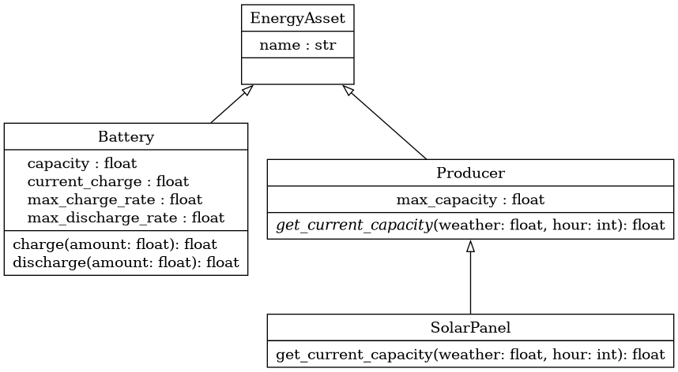

# Konzept

## 1. Use-Case-Beschreibung
Im Rahmen dieses Projekts wird ein **Energy Grid Simulator** entwickelt. Das System simuliert ein lokales, intelligentes Stromnetz (Smart Grid), das Haushalte und kritische Infrastruktur versorgt. 

Das Kernziel der Simulation ist es, die Balance zwischen stark fluktuierender Energieerzeugung (z. B. wetterabhängige Solaranlagen) und dem schwankenden Strombedarf der Verbraucher zu halten. Um Engpässe abzufangen, nutzt das System Batteriespeicher. Reicht die Energie dennoch nicht aus, greift ein automatisches **Load-Shedding-System** (Lastabwurf), welches Verbraucher basierend auf ihrer Prioritätsstufe gezielt vom Netz trennt. 

Dieses Szenario zwingt uns zur Umsetzung einer sauberen objektorientierten Architektur, bei der verschiedene Entitäten (Erzeuger, Verbraucher, Speicher) über ein zentrales Grid-Management miteinander interagieren.

---

## 2. Konzeptionelle Beschreibung der Klassen & Interaktionen

Das System ist stark modular aufgebaut. Neue Erzeuger oder Verbraucher können im späteren Entwicklungsverlauf problemlos hinzugefügt werden, ohne die Kernlogik anpassen zu müssen.

### Zentrale Klassen, Attribute und Methoden

**A. Das Management: `EnergyGrid`**
* **Attribute:** Listen für `producers`, `consumers` und `batteries`. Das aktuelle `weather`.
* **Methoden:** 
    * `simulate_step()`: Führt einen Zeit-Tick (z.B. eine Stunde) in der Simulation aus.
    * `balance_grid()`: Kern-Algorithmus zum Ausgleich von Erzeugung und Verbrauch.
* **Interaktion:** Das Grid ist der "Orchestrator". Es iteriert über alle Erzeuger, um die verfügbare Gesamtenergie zu berechnen, und gleicht diese mit der Summe des Bedarfs aller Verbraucher ab. Überschüsse leitet es an die Methoden der `Battery`-Objekte weiter.

**B. Die Erzeuger: `Producer` (Interface) / `SolarPanel` / `PowerPlant`**
* **Attribute:** `max_output` (maximale Leistung), `base_output` (Grundlast).
* **Methoden:** `get_power_generation(weather)`
* **Interaktion:** Durch das Interface `Producer` kann das `EnergyGrid` alle Erzeuger gleich behandeln (Polymorphie). Das `SolarPanel` berechnet seinen Ertrag dynamisch anhand des übergebenen Wetter-Parameters, während das `PowerPlant` unabhängig vom Wetter eine konstante Leistung zurückgibt.

**C. Die Verbraucher: `Consumer` (Abstrakte Basisklasse) & Kindklassen**
* **Attribute:** `name`, `power_demand`, `priority` (z.B. 1=Kritisch, 2=Normal, 3=Niedrig), `is_connected` (Boolean).
* **Methoden:** `get_demand()`, `connect()`, `disconnect()`
* **Interaktion:** Das `EnergyGrid` fragt den Bedarf ab. Im Falle eines unlösbaren Strommangels ruft das Grid die `disconnect()` Methode der Consumer mit der niedrigsten Priorität auf, um einen Totalausfall zu verhindern. Spezifische Kindklassen (z.B. `Hospital` oder `Factory`) erben diese Logik, definieren aber eigene Bedarfsprofile.

**D. Der Speicher: `Battery`**
* **Attribute:** `capacity` (Maximalkapazität), `current_charge` (aktueller Ladestand), maximale Lade-/Entladerate.
* **Methoden:** `charge(amount)`, `discharge(requested_amount)`
* **Interaktion:** Nimmt überschüssige Energie vom Grid auf oder gibt fehlende Energie ab, limitiert durch die eigenen physikalischen Lade-Eigenschaften.

---

## 3. UML-Klassendiagramm

Die im vorherigen Abschnitt definierten Beziehungen und Hierarchien werden im folgenden Architektur-Diagramm visualisiert:

---

## 4. Umsetzung der Coding-Guidelines

Um eine hohe Code-Qualität und Wartbarkeit zu gewährleisten, werden folgende Richtlinien strikt umgesetzt:

* **Type Hinting:** Alle Methoden-Signaturen und Klassenattribute werden mit Typ-Annotationen versehen. Das minimiert Laufzeitfehler und erleichtert die Zusammenarbeit im Team.
* **Single Responsibility Principle (SRP):** Jede Klasse hat genau eine Aufgabe. Das `SolarPanel` kümmert sich nur um die Wetter-Mathematik, die `Battery` nur um Ladelogik. Das Management des Gesamtnetzes liegt ausschließlich im `EnergyGrid`.
* **PEP8-Konformität:** Wir halten uns an die gängigen Python-Formatierungsregeln, um den Code für alle Beteiligten sauber und einheitlich lesbar zu gestalten.

---

## 5. Aufwandsschätzung & Effiziente Implementierung

**Wie sorgt man vorher für eine effiziente Implementierung?**
Um Reibungsverluste bei der Zusammenarbeit zu vermeiden, setzen wir auf einen **Interface-First-Ansatz**. Bevor die eigentliche Logik ausprogrammiert wird, definieren wir die Schnittstellen (Methodennamen und Rückgabewerte) als leere Rümpfe. 
Dadurch kann die Implementierung effizient parallelisiert werden: Ein Teammitglied kann bereits die Logik des `EnergyGrid` programmieren und mit Dummy-Daten testen, während ein anderes Teammitglied die internen Berechnungen der `SolarPanel` und `Battery` Klassen schreibt. Zudem setzen wir auf einen MVP-Ansatz (Minimum Viable Product): Die Simulation wird zunächst rein textbasiert in der Konsole fertiggestellt und getestet, bevor in einem letzten, isolierten Schritt eine grafische Oberfläche angebunden wird.

**Geschätzter Aufwand:**
* **Architektur & Interfaces:** [ ] Std.
* **Klassen-Logik:** [ ] Std.
* **Grid-Balancing Algorithmus:** [ ] Std.
* **Testing & Bugfixing:** [ ] Std.
* **Dokumentation & Code-Cleanup:** [ ] Std.
* **Gesamt:** [ ] Std.